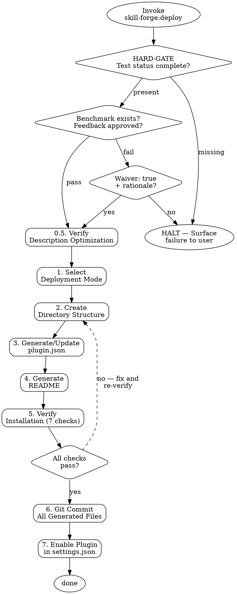

# Skill Forge: Deploy

<HARD-GATE>
Do NOT package any skill until ALL 8 checklist steps below are complete.
Steps: verify test gate → verify description optimization → select mode →
       create structure → generate plugin.json → generate README →
       verify installation → git commit → enable plugin
Producing partial plugin output or committing before verification violates this gate.
</HARD-GATE>

## Checklist

Complete every step in order. Do not skip, reorder, or abbreviate.

0. **Verify test gate** — Confirm ALL of:
   - `phases.test.status == "completed"` in status.json
   - `phases.test.benchmark` path exists on disk (benchmark.json)
   - Final iteration's feedback.json indicates user approval (empty feedback = approval)
   OR: `waiver: true` with user-provided rationale in status.json.
   If neither condition is met → halt and surface the failure to the user. Do not proceed.

0.5. **Verify description optimization** — If `phases.test.description_optimized == true` in status.json, confirm that SKILL.md's frontmatter `description` has been updated with the optimized result (`best_description`). If not yet applied, apply it before continuing. If description optimization was not run (`description_optimized` is absent or false), skip this step.

1. **Select deployment mode** — Present the deployment modes table below to the user and wait for their explicit choice before continuing.

2. **Create directory structure** — Create `skills/{name}/SKILL.md` plus any supporting files (tables, templates, guides) referenced from SKILL.md in the same directory.

3. **Generate/update plugin.json** — Using [plugin-template.json](plugin-template.json) as the base, fill `name`, `version`, and `description`. Skills are auto-discovered from the `skills/` directory — do NOT add explicit skill paths.

4. **Generate README** — Write `README.md` at the plugin root with: installation instructions, usage examples, and trigger conditions for each skill.

5. **Verify installation** — Run all 7 checks from the Installation Verification Checklist below. Record pass/fail for each. Do not commit if any check fails.

6. **Git commit** — Stage all generated files and commit. Message format: `feat: add {skill-name} skill to {plugin-name}`.

7. **Enable plugin** — Add `"{plugin-name}@{marketplace}": true` to `enabledPlugins` in `~/.claude/settings.json`. If the plugin is being added to an existing enabled plugin, this step is already satisfied. Verify the entry exists after editing.

---

## Deployment Modes

| Mode | Target Path | Use Case |
|------|------------|----------|
| Add to existing plugin | `~/.claude/plugins/{plugin}/skills/{name}/` | Grouping related skills |
| New plugin | `~/.claude/plugins/{name}/` | Independent skill set |
| Minimal plugin | `~/.claude/plugins/{name}/` | Single skill wrapped in minimal plugin structure |

---

## Installation Verification Checklist

| # | Check |
|---|-------|
| 1 | SKILL.md exists at correct path |
| 2 | Frontmatter `name` matches directory name |
| 3 | plugin.json is valid JSON |
| 4 | Supporting file paths match SKILL.md references |
| 5 | `description` under 1024 characters |
| 6 | Skill invocation loads SKILL.md body correctly |
| 7 | Test report exists with passing scores or valid waiver |

---

## Multi-Platform Artifacts

For skills that pass the portability audit (Axis 3 >= 60), generate install guides for each target platform:

```
{plugin}/
├── skills/{name}/SKILL.md
├── INSTALL-claude.md
├── INSTALL-codex.md
└── INSTALL-gemini.md
```

Each INSTALL file describes the manual steps to activate the skill on that platform. Include the path where SKILL.md must be placed, any environment configuration, and how to invoke the skill.

---

## Process Flow



---

## Rationalization Table

| Rationalization | Correct Response |
|----------------|-----------------|
| "The skill looks good — I can skip checking the test report score" | The test gate exists precisely because visual inspection does not predict agent compliance. A skill can look well-structured and still score below passing on pressure tests. Always read the scores. |
| "The waiver just needs to exist — I don't need to check the rationale" | A waiver without user rationale is invalid. The rationale is the user taking explicit ownership of deploying below threshold. Without it, the waiver is a blank pass, which defeats the purpose. |
| "plugin.json doesn't need skill paths since they're auto-discovered, so I can skip generating it" | plugin.json is required even without skill paths — it provides the plugin's name, version, and description. A missing plugin.json breaks installation regardless of auto-discovery. |
| "Verification is redundant — I just created the files" | Creation and correctness are separate concerns. The 7-check verification catches path mismatches, JSON syntax errors, and reference drift that occur during generation. Skipping it lets silent failures reach users. |

---

## Portability Adapter

| Tool / Feature | Platform Gap | Fallback |
|----------------|-------------|---------|
| Bash / shell execution | Claude.ai web, some API deployments | Use Read + Glob + Grep tools to verify file existence and content. If shell is unavailable, perform each verification check manually using file read tools and document findings inline. |
| Write / Edit tools | Pure API / stateless contexts | Use shell redirects (`echo`, `cat >`) or request the user create files manually from the generated content. |
| Glob / Grep tools | Codex without file tools | Use `ls` and `grep -r` shell commands as equivalents. |
| Git (commit step) | Environments without git | Document all generated files and their intended paths. Provide the user with the commit command to run manually. |

---

## References

- [plugin-template.json](plugin-template.json) — Base template for generating plugin.json files
- `../test/SKILL.md` — Test skill that produces benchmark.json and feedback.json
- `../test/references/schemas.md` — JSON schemas for evals, grading, benchmark data
- `../write/portability-guide.md` — Cross-platform tool mapping for portability audit
