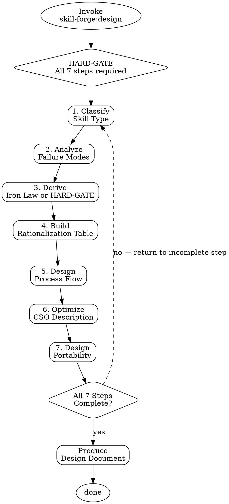

# Skill Forge: Design

<HARD-GATE>
Do NOT produce a design document until ALL 7 checklist steps below are complete.
Steps: classify → analyze failure modes → derive law/gate → build rationalization table
       → design process flow → optimize CSO → design portability
Producing partial output or a "draft" before completing all steps violates this gate.
</HARD-GATE>

## Checklist

Complete every step in order. Do not skip, reorder, or abbreviate.

1. **Classify skill type** — Determine whether the skill is discipline, workflow, technique, or reference. Use the Skill Type Classification Matrix below.
2. **Analyze failure modes** — Systematically identify how agents will skip or bypass this skill. Use the 5-category framework from `pattern-library.md`.
3. **Derive enforcement mechanism** — For discipline type: write the Iron Law (`NO X WITHOUT Y FIRST`). For workflow type: write the HARD-GATE. See `pattern-library.md`.
4. **Build rationalization table** — Map predicted agent excuses to authoritative counter-arguments. Minimum 3 entries. See `pattern-library.md`.
5. **Design process flow** — Identify decision points, loops, and gates. Produce a Graphviz digraph.
6. **Optimize CSO** — Craft the trigger description starting with "Use when...". Apply all rules from `cso-guide.md`.
7. **Design portability** — Map all tool dependencies across Claude Code, Codex CLI, and Gemini CLI. Document fallbacks.

---

## Design Document Schema

Output the design document using exactly this structure:

```markdown
# {Skill Name} — Design

## Metadata
- **Type:** discipline | workflow | technique | reference
- **Name:** {hyphenated-name}
- **Trigger:** {CSO description starting with "Use when..."}

## Iron Law
{For discipline type only. "NO X WITHOUT Y FIRST". Workflow types use HARD-GATE instead — omit this section.}

## Failure Modes
| Mode | Predicted Behavior | Defense |

## Rationalization Table
| Excuse | Counter |

## Process Flow
{Graphviz digraph}

## Portability
| Tool Used | Claude Code | Codex CLI | Gemini CLI | Fallback |

## Success Criteria
{Numbered list of measurable outcomes}
```

---

## Skill Type Classification Matrix

| Type | Characteristics | Persuasion Principles | Examples |
|------|-----------------|-----------------------|----------|
| **Discipline** | Permanent behavioral rule; applies every time; never optional | Authority + Commitment + Social Proof | Always run tests before committing; never write without a design doc |
| **Workflow** | Ordered steps for a single invocation; has a defined output; gates matter | Commitment + Scarcity | Design a skill; review a PR; deploy a release |
| **Technique** | Best-practice guidance; agent uses judgment on when and how to apply | Moderate Authority + Unity | How to write clear variable names; when to use recursion |
| **Reference** | Lookup data; no enforcement needed; consulted not executed | Clarity only | Pattern library; API cheat sheet; CSO guide |

**Decision rule:** If the skill contains an ordered checklist with a defined output artifact, it is workflow. If it states a permanent non-negotiable rule, it is discipline. If it provides guidance that the agent applies with judgment, it is technique. If it is purely informational, it is reference.

---

## Portability Matrix

| Element | Claude Code | Codex CLI | Gemini CLI |
|---------|-------------|-----------|------------|
| Skill tool invocation | `Skill("name")` | Not supported | Not supported |
| File read | Read tool | `cat` / shell | `cat` / shell |
| File write | Write / Edit tool | Shell redirect | Shell redirect |
| Graphviz rendering | Code block (not rendered) | Code block | Code block |
| Frontmatter parsing | Native | Manual parse | Manual parse |

---

## Process Flow



---

## Anti-Pattern: "This Is Too Simple"

Every skill idea — no matter how obvious — goes through this full design process. There are no exceptions.

**Why:** Failure modes are invisible until you enumerate them. A skill that "seems simple" has the same failure categories as a complex one: agents will skip steps, substitute outputs, escape scope, and rationalize violations. The design process exists precisely because simplicity is an illusion when applied to agent behavior.

A skill author who says "this is too simple for design" is in the exact failure mode this skill was built to prevent.

---

## Rationalization Table

| Excuse | Counter |
|--------|---------|
| "This idea is simple enough to skip design" | Design catches failure modes invisible in advance. Simplicity in an idea does not reduce the agent's tendency to skip, shortcut, or substitute. The design step costs minutes; the failure mode it catches costs the entire write phase. |
| "I already know what type this is" | Classification is not just labeling — it determines the enforcement skeleton (Iron Law vs HARD-GATE), the persuasion principles, and which lint rules apply. Skipping classification produces a structurally mismatched skill. |
| "The user wants output fast, I'll come back to design" | Backfill is rationalization. Agents that defer design never return to it. The HARD-GATE exists because output pressure is the primary cause of design-phase bypass. |

---

## Portability Adapter

When operating outside Claude Code (e.g. Codex CLI, Gemini CLI):

- The `Skill` tool is not available. Invoke design manually by following this checklist directly.
- File read/write must use shell commands (`cat`, `echo`, redirect operators).
- Graphviz diagrams are produced as code blocks only — do not attempt rendering.
- Frontmatter must be parsed manually from the first `---` block.
- The HARD-GATE still applies: do not produce output before completing all 7 steps.

---

## References

- `pattern-library.md` — Iron Law, HARD-GATE, Rationalization Table, Red Flags, Persuasion Principles, Failure Mode Analysis Framework
- `cso-guide.md` — Description rules, good/bad examples, CSO checklist
