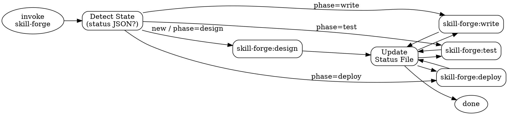

# Skill Forge — Orchestrator

## Overview

Skill Forge is a four-phase pipeline for creating, improving, and validating Claude Code skills.
Phases: **design → write → test → deploy**.

The orchestrator owns all state. Sub-skills are stateless executors.

## Process Flow



## Checklist

1. Detect state — look up `docs/skill-forge/<skill_name>-status.json`
2. Determine `current_phase` from status file (or `design` if none)
3. Enforce hard gate — verify predecessor output exists
4. Route to the correct sub-skill via Skill tool
5. On success, create or update the status file
6. Repeat until `deploy` phase completes

## State Detection Logic

```
STATUS_DIR = docs/skill-forge/
STATUS_FILE = STATUS_DIR/<skill_name>-status.json

if STATUS_FILE exists:
    load JSON → read current_phase, phases map
else:
    current_phase = "design"
    create new status file (see Status File Management)
```

`skill_name` is derived from the user's argument (e.g. `/skill-forge my-skill` → `my-skill`).

## Routing Table

| `current_phase` | Hard Gate (must exist)                                    | Sub-skill invocation          |
|-----------------|-----------------------------------------------------------|-------------------------------|
| `design`        | none                                                      | `Skill("skill-forge:design")` |
| `write`         | `phases.design.output` file exists                        | `Skill("skill-forge:write")`  |
| `test`          | `phases.write.output` file exists                         | `Skill("skill-forge:test")`   |
| `deploy`        | `phases.test.status == "completed"` AND `phases.test.benchmark` path exists | `Skill("skill-forge:deploy")` |

## Hard Gates

Before routing, verify the predecessor output. If the gate fails, stop and report what is missing.

- **write gate**: `phases.design.output` path must exist on disk
- **test gate**: `phases.write.output` path (SKILL.md) must exist on disk
- **deploy gate**: `phases.test.status` must equal `"completed"` AND `phases.test.benchmark` path must exist on disk

Do NOT invoke the sub-skill if its gate is not satisfied.

## Status File Management

Location: `docs/skill-forge/<skill_name>-status.json`

**On first invocation (no status file):**

Create the file with `current_phase: "design"` and all phases set to `pending`.

```json
{
  "skill_name": "<skill_name>",
  "created_at": "<today>",
  "current_phase": "design",
  "phases": {
    "design": { "status": "pending" },
    "write":  { "status": "pending" },
    "test":   { "status": "pending" },
    "deploy": { "status": "pending" }
  }
}
```

**After a phase completes:**

Set the completed phase `status` to `"completed"`, record its `output`, and advance `current_phase` to the next phase.

```json
{
  "skill_name": "example-skill",
  "created_at": "2026-03-24",
  "current_phase": "write",
  "phases": {
    "design": { "status": "completed", "output": "docs/skill-forge/example-skill-design.md" },
    "write":  { "status": "in_progress" },
    "test":   { "status": "pending" },
    "deploy": { "status": "pending" }
  }
}
```

**After test phase completes:**

The test phase records additional fields beyond the standard `status` and `output`:

```json
{
  "skill_name": "example-skill",
  "created_at": "2026-03-24",
  "current_phase": "deploy",
  "phases": {
    "design": { "status": "completed", "output": "docs/skill-forge/example-skill-design.md" },
    "write":  { "status": "completed", "output": "skills/example-skill/SKILL.md" },
    "test":   {
      "status": "completed",
      "output": "example-skill-workspace/iteration-2/",
      "benchmark": "example-skill-workspace/iteration-2/benchmark.json",
      "description_optimized": true
    },
    "deploy": { "status": "in_progress" }
  }
}
```

Additional test phase fields:
- `benchmark`: Path to the final iteration's benchmark.json (required for deploy gate)
- `description_optimized`: Whether description optimization was run (optional, defaults to false)

**Rules:**
- Only the orchestrator creates or modifies status files
- Sub-skills may read the status file for context but must never write to it

## Independent Invocation Rules

When a user calls a sub-skill directly (e.g. `/skill-forge:design`):

1. **No status file present** — the sub-skill runs statelessly; no status file is created before, during, or after the sub-skill execution.
2. **Status file present** — the sub-skill reads it for context but does NOT advance `current_phase` or modify any field.
3. **Only the orchestrator** creates and manages status files; sub-skills are read-only consumers of state.
