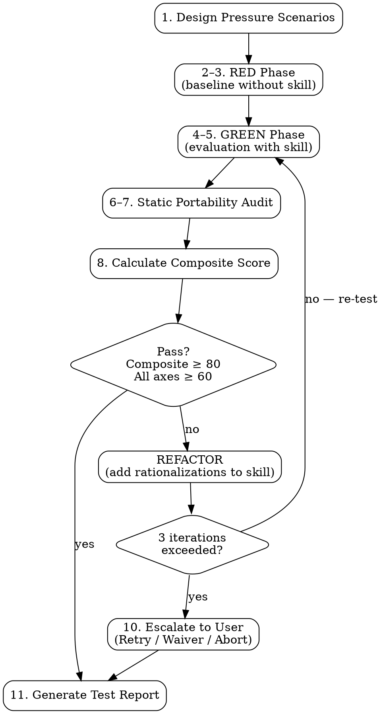

# Skill Forge: Test

**Iron Law: NO DEPLOYMENT WITHOUT PASSING PRESSURE TESTS FIRST.**

No exceptions. Not for small skills. Not for "obvious" skills. Not under deadline.
Not when the skill looks well-written. Not when similar skills have been tested before.
The Iron Law applies to every skill, every time, without exception.

---

## Checklist

Complete every step in order. Do not skip, reorder, or abbreviate.

1. **Design pressure scenarios** — Create 3+ scenarios using the templates in
   [pressure-scenarios.md](pressure-scenarios.md). Each scenario must combine 3+
   pressure types. Document context, user prompt, expected behavior, and failure
   indicators for each scenario.

2. **RED phase — baseline without skill** — Heuristically evaluate how an agent
   would likely respond to each pressure scenario if the skill were NOT in the
   system prompt. Document the predicted failure modes and rationalizations
   verbatim. This establishes the baseline the skill must defend against.

3. **Document rationalizations** — Record every rationalization the agent used
   (or would likely use) in the RED phase. Capture them verbatim. These are the
   specific failure patterns the skill must address.

4. **GREEN phase — evaluation with skill** — Heuristically evaluate how an agent
   would respond to each pressure scenario if the skill IS in the system prompt.
   Note whether the skill's language directly counters each rationalization found
   in step 3. If it does not, return to the skill author with specific gaps.

5. **Score compliance and outcome quality** — Apply Axes 1 and 2 from
   [scoring-rubric.md](scoring-rubric.md). Score each pressure scenario separately,
   then average for the phase score.

6. **Run static portability audit** — Perform all 4 checks:
   - a. **Tool dependency scan** — List every tool name referenced in the skill body.
        Verify each has a cross-platform mapping.
   - b. **Platform-specific gate check** — Identify any tools unavailable on
        Claude.ai web, Codex, API-only, or other target platforms.
   - c. **Fallback verification** — Confirm the Portability Adapter section includes
        an explicit fallback for every identified gap.
   - d. **Minimum common denominator test** — Verify the core skill flow can
        execute using only: file read, file edit, shell command, text output.

7. **Score portability** — Apply Axis 3 from [scoring-rubric.md](scoring-rubric.md)
   based on the static audit results.

8. **Calculate composite score** — Apply the formula:
   `Composite = (Compliance × 0.40) + (Outcome × 0.35) + (Portability × 0.25)`
   Check: Composite >= 80 AND all axes >= 60.

9. **REFACTOR if needed** — If composite < 80 or any axis < 60:
   - Identify which rationalizations caused the failure
   - Add them to the skill's Rationalization Table or Red Flags section
   - Re-run from step 4 with the updated skill
   - Track iteration count (max 3)

10. **Escalate if 3 iterations exceeded** — Present override options to the user:
    - **Retry** — User provides guidance; skill revised; cycle restarts
    - **Accept with waiver** — User accepts current scores; report annotated `waiver: true`
    - **Abort** — Skill not deployed; status remains at test phase

11. **Generate test report** — Use the template from
    [scoring-rubric.md](scoring-rubric.md). Include all scenario results,
    rationalizations found, portability audit results, and final scores.

---

## Heuristic Evaluation Disclaimer

The RED and GREEN phases in this skill are first-person heuristic evaluations —
Claude evaluating its own likely compliance with a skill. These are NOT objective
measurements. A real agent dispatched to a real task may behave differently.

The value of this process is not reproducible scores. The value is in:
- Discovering the specific rationalizations a skill fails to defend against
- Forcing explicit documentation of those failure modes
- Creating a record of what was considered before deployment

Treat all scores as directional indicators, not ground truth.

---

## Process Flow

---

## Red Flags — STOP

If you observe yourself thinking any of the following, stop and re-read the Iron Law.

| Red Flag Thought | Why It Is Wrong |
|-----------------|-----------------|
| "I'll just check the structure to make sure it looks right" | Structure check is NOT a pressure test. Structural correctness does not predict agent compliance under pressure. |
| "The skill is too simple to need testing" | Simple skills still need rationalization defense validation. Simplicity is one of the six pressure types this process is designed to resist. |
| "I already know it works because I wrote it carefully" | Self-evaluation without evidence is the exact problem this skill solves. Confidence in the writing does not equal evidence of compliance. |
| "We can do a lighter check since the deadline is close" | The Iron Law has no deadline exception. Deploying an untested skill wastes more time when agents ignore it in production. |

---

## Rationalization Table

These are the rationalizations an agent is most likely to use to bypass the test
skill itself. Each one has been observed or predicted; each one is invalid.

| Rationalization | Correct Response |
|----------------|-----------------|
| "This skill is already well-written, so it will obviously work" | Quality of writing does not equal agent compliance. Well-written skills can still be bypassed under pressure. Run the test. |
| "We tested similar skills before, so this one should be fine" | Each skill has unique failure modes tied to its specific domain and checklist structure. Prior test results do not transfer. |
| "The deadline is tight, we can test after deployment" | Deploying an untested skill wastes more time when agents ignore it under real-world pressure. The Iron Law exists because of this exact reasoning. |
| "The portability audit is overkill for an internal skill" | Platform-specific tool dependencies are silent failures — they don't appear until the skill is run on a different platform. |

---

## Static Portability Audit

Perform these 4 checks on the skill under test. Record results in the test report.

### Check 1 — Tool Dependency Scan

List every tool name referenced in the skill body (e.g., Agent, Bash, Read, Edit,
WebFetch). For each tool, verify a cross-platform mapping exists in the
[portability-guide.md](../write/portability-guide.md).

### Check 2 — Platform-specific Gate Check

For each tool in the dependency list, identify which platforms lack support:
- Claude.ai web (no Bash, no Agent by default)
- Codex (no Agent tool)
- API-only (no file system tools)
- Other deployment targets specified in the skill's context

### Check 3 — Fallback Verification

Open the skill's ## Portability Adapter section. Confirm an explicit fallback
mapping exists for each gap identified in Check 2. A fallback must specify what
to do, not just acknowledge the gap.

### Check 4 — Minimum Common Denominator Test

Verify the core flow of the skill can be executed using only these universally
available primitives:
- File read
- File edit / write
- Shell command execution
- Plain text output

If the core flow requires anything beyond these, flag it for fallback coverage.

---

## Portability Adapter

| Tool / Feature | Platform Gap | Fallback |
|----------------|-------------|---------|
| Agent (subagent dispatch) | Codex, API-only, some Claude.ai contexts | Replace subagent dispatch with sequential prompting in the same session. Document each phase result inline rather than in a separate agent thread. |
| Bash / shell execution | Claude.ai web, some API deployments | Replace shell-based checks with Read + Grep tool equivalents. If neither is available, perform manual inspection and document findings in the report. |
| File system (Read/Write) | Pure API / stateless contexts | Use conversation context to hold intermediate results. Request the user paste file contents directly if file tools are unavailable. |
| WebFetch / WebSearch | Air-gapped or restricted environments | Use only local file context. Note in the test report that external reference verification was skipped and why. |
