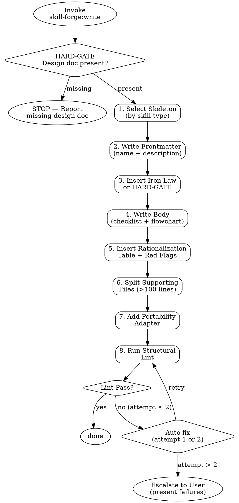

# Skill Forge: Write

<HARD-GATE>
Do NOT generate any SKILL.md content until the design document exists at
`docs/skill-forge/<skill-name>-design.md`.
Steps: verify design doc → select skeleton → write frontmatter → insert gate →
       write body → insert rationalization + red flags → split files → add portability → run lint
Producing a partial SKILL.md or "draft" before completing all steps violates this gate.
</HARD-GATE>

## Checklist

Complete every step in order. Do not skip, reorder, or abbreviate.

1. **Select skeleton** — Read the design doc `## Metadata` section. Match skill type to the correct template:
   - `discipline` → `skeleton-templates/discipline.md`
   - `workflow` → `skeleton-templates/workflow.md`
   - `technique` → `skeleton-templates/technique.md`
   - `reference` → `skeleton-templates/reference.md`

2. **Write frontmatter** — Set `name` (hyphens only, lowercase) and `description` (starts with "Use when", no workflow summary). Copy `## Metadata → Trigger` from the design doc as the description. Verify against CSO rules in `../design/cso-guide.md`.

3. **Insert Iron Law or HARD-GATE** — Discipline type: insert Iron Law from `## Iron Law` in the design doc. Workflow type: insert `<HARD-GATE>` block listing all checklist steps. Do not mix — discipline skills do not use HARD-GATE; workflow skills do not use Iron Law.

4. **Write body** — Fill the skeleton body from the design doc:
   - Checklist steps from `## Process Flow`
   - Flowchart (Graphviz digraph) from `## Process Flow`
   - Anti-patterns from `## Failure Modes`
   - Keep SKILL.md body under 500 lines total

5. **Insert rationalization table and Red Flags** — Copy `## Rationalization Table` from the design doc verbatim. For discipline-type skills, also add a `## Red Flags — STOP` section derived from the failure modes.

6. **Split supporting files** — Scan the SKILL.md draft for any reference section exceeding 100 lines. Move it to a separate file in the same skill directory. Replace with a one-line link: `See [filename](filename)`.

7. **Add portability adapter** — Add `## Portability Adapter` section at the end. Map every platform-specific tool in the skill body to its fallback. Use `portability-guide.md` as the reference.

8. **Run structural lint** — Validate the completed SKILL.md against the lint checklist below. Attempt auto-fix for mechanical failures (max 2 attempts). If lint still fails after 2 attempts, pause and present the failure to the user.

---

## Design Document Input Format

The write skill reads these headings from the design document:

| Heading | Used For |
|---------|----------|
| `## Metadata` | Skill type, name, CSO trigger description |
| `## Iron Law` | Discipline-type enforcement (omit for workflow) |
| `## Failure Modes` | Anti-patterns, Red Flags section |
| `## Rationalization Table` | Verbatim rationalization table |
| `## Process Flow` | Checklist steps and Graphviz flowchart |
| `## Portability` | Portability Adapter section content |
| `## Success Criteria` | Lint validation reference |

If any heading is missing from the design document, stop and report which heading is absent before proceeding.

---

## Structural Lint Checklist

| # | Check | Discipline | Workflow | Technique | Reference |
|---|-------|:---:|:---:|:---:|:---:|
| 1 | `name` uses hyphens only (no spaces, underscores, uppercase) | R | R | R | R |
| 2 | `description` starts with "Use when" | R | R | R | R |
| 3 | `description` has no workflow summary (no steps, output format, or internal logic) | R | R | R | R |
| 4 | Iron Law present | R | - | - | - |
| 5 | HARD-GATE present | - | R | - | - |
| 6 | Rationalization table present | R | R | - | - |
| 7 | Red Flags section present | R | - | - | - |
| 8 | Process flowchart present (Graphviz digraph) | R | R | - | - |
| 9 | Checklist present | R | R | - | - |
| 10 | SKILL.md body < 500 lines | R | R | R | R |
| 11 | Reference sections > 100 lines split to separate files | R | R | R | R |
| 12 | Portability Adapter section present | R | R | R | R |

R = Required, - = Not Required

---

## Lint Failure Escalation

1. **Attempt auto-fix** — For mechanical failures (e.g., missing trailing newline, `name` contains spaces), fix directly and re-validate.
2. **Re-validate** — Run the lint checklist again from top to bottom.
3. **Escalate if still failing** — If the SKILL.md fails after 2 auto-fix attempts, stop. Present a table of failing checks to the user and wait for guidance.
4. **Maximum 2 auto-fix attempts** before escalation. Do not loop indefinitely.

---

## Process Flow

---

## Writing Philosophy

스킬을 작성할 때 다음 원칙을 따른다. 이 원칙들은 skeleton 기반 체크리스트를 보완하는
가이드이며, 체크리스트의 기계적 정확성과 함께 적용한다.

### Why를 설명하라
MUST, NEVER, ALWAYS 같은 강제 언어 대신, 그 규칙이 왜 중요한지 이유를 전달하라.
오늘날의 LLM은 좋은 theory of mind을 가지고 있어서, 이유를 이해하면 규칙을 더 잘
따른다. 강제 언어가 필요하면 쓰되, 이유를 먼저 제시한 후 보강으로 사용하라.

### 과적합하지 마라
테스트 케이스에만 맞는 좁은 지시를 피하라. 스킬은 수많은 다른 프롬프트에서 사용된다.
특정 예시에 대한 fiddly한 수정 대신, 일반화 가능한 원칙을 작성하라.
막힐 때는 다른 메타포나 패턴을 시도하라 — 시도 비용은 낮다.

### 반복 작업을 번들링하라
테스트 중 서브에이전트가 반복적으로 비슷한 헬퍼 스크립트를 작성하는 패턴이 보이면,
그 스크립트를 `scripts/`에 번들하라. 매 실행마다 바퀴를 재발명하는 것을 방지한다.

### Lean하게 유지하라
테스트 실행 트랜스크립트를 읽고, 모델이 비생산적인 작업에 시간을 쓰게 만드는
지시가 있으면 제거하라. 가치를 주지 않는 것은 삭제하라.

---

## Rationalization Table

| Excuse | Counter |
|--------|---------|
| "The design doc has enough info — I can write the SKILL.md directly without following the checklist" | The checklist exists because writing order matters: frontmatter errors propagate into the body, and skipping lint means defective skills enter the pipeline. Each step depends on the previous one being correct. |
| "The skill is simple — I'll skip the skeleton and write from scratch" | Skeletons encode structural requirements that are invisible when writing from scratch. A skill written without a skeleton will almost always fail the lint checklist on first pass. The skeleton saves more time than it costs. |
| "Lint failures are minor — I'll skip the fix and move on" | Minor lint failures (e.g., missing Portability Adapter, wrong `name` format) silently break downstream consumers. The test and deploy phases depend on structural correctness. Skipping lint pushes failures forward where they cost more to fix. |
| "The design doc doesn't have all the headings — I'll infer what's missing" | Inference from incomplete design documents produces structurally inconsistent skills. The correct action is to stop and report which heading is missing, then let the user fix the design document before continuing. |

---

## Portability Adapter

When operating outside Claude Code (e.g. Codex CLI, Gemini CLI):

- **Skill tool:** Not available. Read each sub-skill's `SKILL.md` manually with `cat` and follow its checklist directly.
- **Read / Write / Edit tools:** Not available. Use `cat`, `echo`, and shell redirects (`>`, `>>`) instead.
- **Grep / Glob tools:** Not available. Use `grep -r` and `ls` shell commands instead.
- **HARD-GATE still applies:** Do not produce any SKILL.md content before verifying the design document exists and completing all 8 checklist steps.

---

## References

- `skeleton-templates/discipline.md` — Skeleton for discipline-type skills
- `skeleton-templates/workflow.md` — Skeleton for workflow-type skills
- `skeleton-templates/technique.md` — Skeleton for technique-type skills
- `skeleton-templates/reference.md` — Skeleton for reference-type skills
- `portability-guide.md` — Full cross-platform tool mapping and fallback patterns
- `../design/cso-guide.md` — Frontmatter `name` and `description` rules
- `../design/pattern-library.md` — Iron Law, HARD-GATE, Rationalization Table, Red Flags patterns
